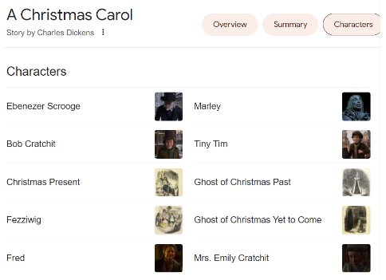
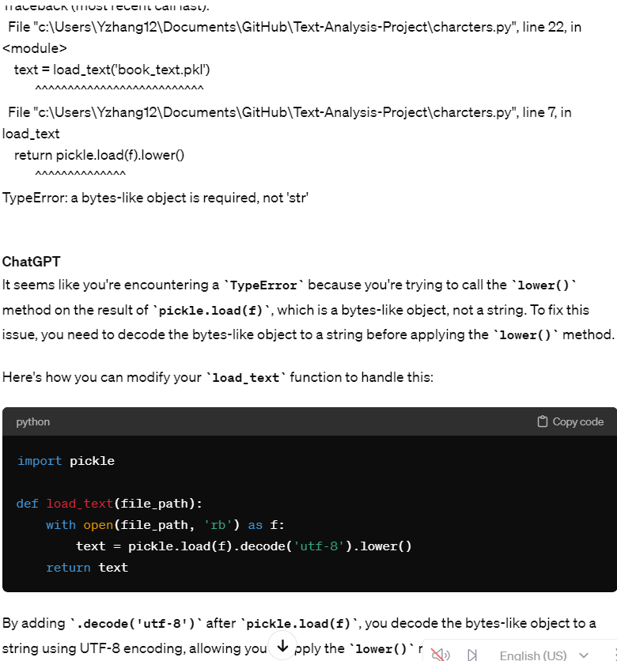
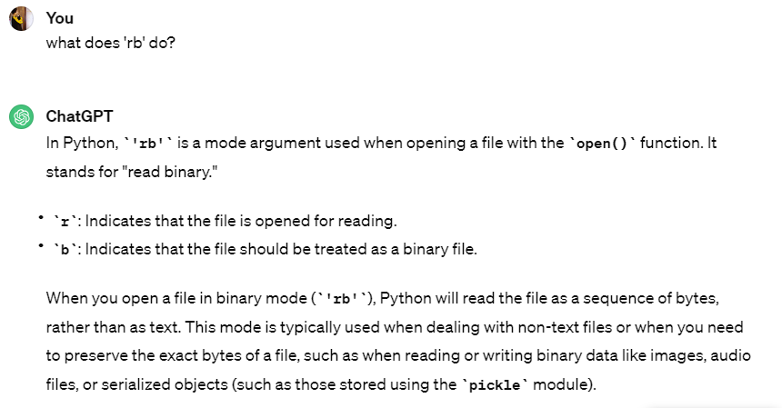
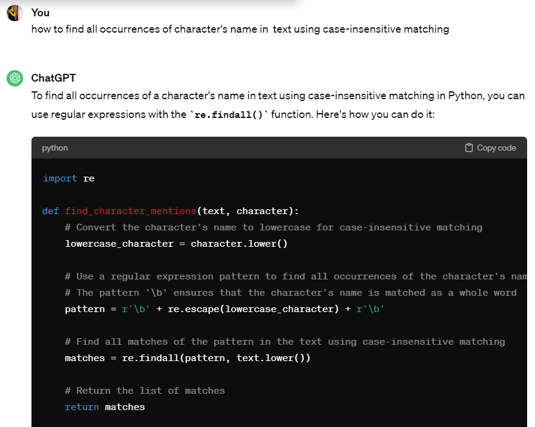
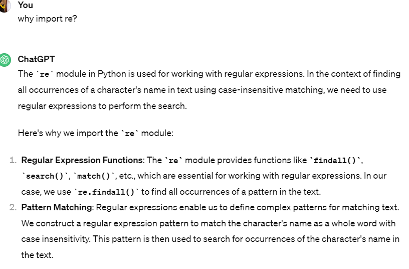
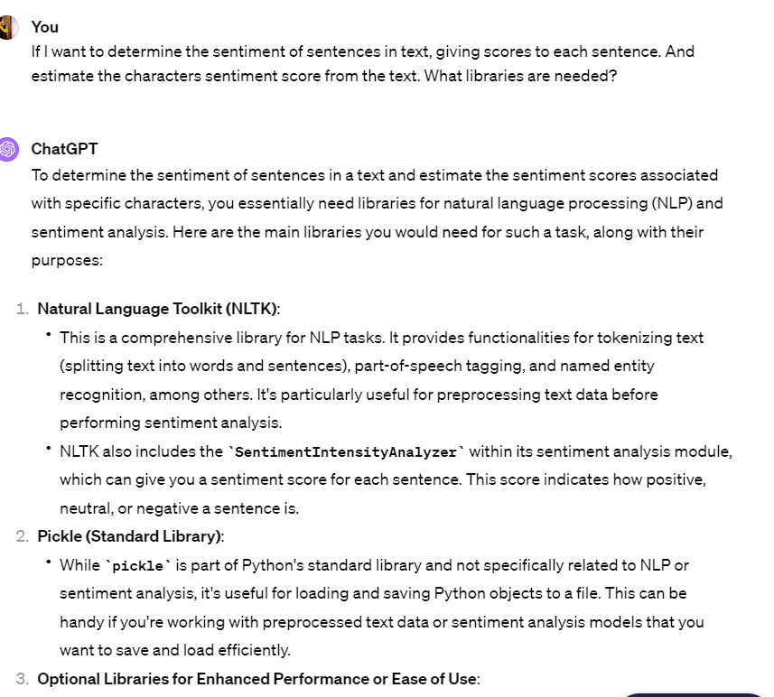
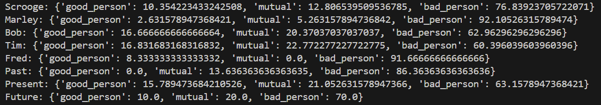
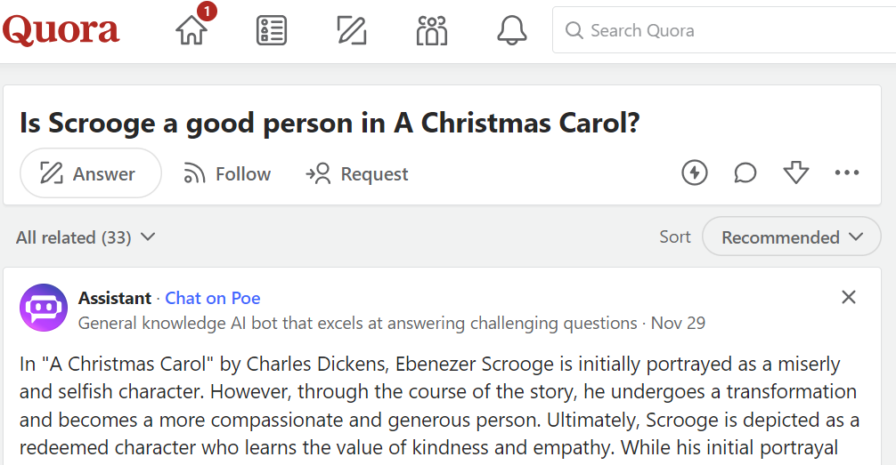

# Text-Analysis-Project
## **1. Project Overview**

I wanted to dive into "A Christmas Carol" by Charles Dickens, a book I picked up from Project Gutenberg. My goal was pretty straightforward: I aimed to figure out how often the main characters popped up in the story and to understand if they were shown in a good or bad light. To do this, I used a tool called NLTK, which helps with breaking down and analyzing texts. The idea was to dig deep into how Dickens portrayed these characters and see what that tells us about the story as a whole. For practice, I also decided to check out which words showed up the most in the book. I kept track of how often each word appeared and saved this information in a file named 'refined_word_frequencies.txt'.

## 2. Implementation
**Pre-work**

I begin by importing the required libaries for text processing and the sentiment analysis. Including NLTK for natural language processing and the pickle for loading my text data. I have a pickle file containing the book text, so each time it will load the text data from the file. 
```python
import re  
import nltk
import pickle
from nltk.sentiment import SentimentIntensityAnalyzer   
from nltk.tokenize import sent_tokenize 
```
Next, I defined a list of main characters that I want to analyze on later. Since the charcters have to be relevent to the text, so I googled the main characters in book 'A Christmas Carol'. 



**Frequency Analysis**

For frequency analysis, I wrote the 'count_character_mentions' function to count the fequency of character mentions in the book text. This invovled iterating through the text and counting occurrences of each character's name. 
```python
def count_mentions_simple(text, chars):
    """Count mentions of each character"""
    character_counts = {} # empty dic for storage
    for char in chars:
        count = 0
        lowercases_character = char.lower()  
        # I asked chatgpt how to find all occurrences of names using case-insensitive matching.
        # Chatgpt told me to use re.findall() function, to find all matches of the patterns in the lowercase text
        # and it also imported 're' in lib
        matches = re.findall(r'\b' + re.escape(lowercases_character) + r'\b', text.lower())
        count = len(matches)
        character_counts[char] = count
    return character_counts

chars = ['Scrooge', 'Marley', 'Bob', 'Tim', 'Fred', 'Past', 'Present', 'Future']
```

In the main block, I loaded the book text, performed charcter mention frequency analysis, and printed out the results. 

- Difficuties During Writing

I faced challenges in understanding the nuances of file handling, particularly when dealing with pickled data and choosing the appropriate file handling mode ('rb' mode). ChatGpt helped me learned the importance of selecting the correct file handling mode ('rb' mode) when working with pickled data to ensure seamless data retrieval and processing. 

And I struggled to grasp the nuances of regular expressions, especially understanding the syntax and various pattern matching techniques. However, after asking ChatGPT for advice, it recommended experimenting with regex functions such as 're.findall()', using word boundaries ('\b'), and employing 're.escape()' for special character handling.

I also encountered difficulties in handling special characters within character names, leading to unexpected matching issues. Again, ChatGPT's recommendation to use the 're.escape()' function helped me master special character handling, preventing unintended matching issues and ensuring accurate pattern matching.









**Sentiment analysis**

For sentiment analysis, I implemented the 'analyze_character_sentiment' function to perform sentiment analysis for sentences mentioning characters. I sused NLTK's 'SentimentIntensityAnalyzer' to assign sentiment scores to sentences containing character names. 
```python
def analyze_character_sentiment(book_text, characters = ['Scrooge', 'Marley', 'Bob', 'Tim', 'Fred', 'Past', 'Present', 'Future']):
    """analyze sentiment for sentences mentioning characters"""
    tool = SentimentIntensityAnalyzer()
    sentences = sent_tokenize(book_text)  # Chatgpt debugged and said I need to split the text into sentences. 
    sentiment_counts = {
                        'Scrooge': {'good_person': 0, 'mutual': 0, 'bad_person': 0},
                        'Marley': {'good_person': 0, 'mutual': 0, 'bad_person': 0},
                        'Bob': {'good_person': 0, 'mutual': 0, 'bad_person': 0},
                        'Tim': {'good_person': 0, 'mutual': 0, 'bad_person': 0},
                        'Fred': {'good_person': 0, 'mutual': 0, 'bad_person': 0},
                        'Past': {'good_person': 0, 'mutual': 0, 'bad_person': 0},
                        'Present': {'good_person': 0, 'mutual': 0, 'bad_person': 0},
                        'Future': {'good_person': 0, 'mutual': 0, 'bad_person': 0},
                        }
    
    for sentence in sentences:  # go through each sentences.
        for character in character_list:
            if character.lower() in sentence:
                score = tool.polarity_scores(sentence)['compound']
                if score >= 0.6:
                    sentiment_counts[character]['good_person'] += 1
                elif score >= 0.3:
                    sentiment_counts[character]['mutual'] += 1
                else:
                    sentiment_counts[character]['bad_person'] += 1

    return sentiment_counts
```
After that I think it will be better to mentally process the information if I develop a function to calculate the percentage of sentiment (good, mutual, bad) for each charcter based on the sentiment counts. 
```python
def calculate_sentiment_percentage(sentiment_counts):
    """calculate percentage of sentiment for each character"""
    sentiment_percentages = {}
    for character in sentiment_counts:
        counts = sentiment_counts[character]
        total_mentions = 0  #initial
        for sentiment in counts: 
            total_mentions += counts[sentiment]
        # I think turning into percentage is better to process
        good_percent = (counts['good_person'] / total_mentions) * 100
        mutual_percent = (counts['mutual'] / total_mentions) * 100
        bad_percent = (counts['bad_person'] / total_mentions) * 100
        sentiment_percentages[character] = {
            'good_person': good_percent,
            'mutual': mutual_percent,
            'bad_person': bad_percent
        }
    return sentiment_percentages

```
In the main block, I loaded the book text, analyzed chacrter sentiment, and calculated sentiment percentages. 

- Difficuties During Writing:

Initially, I struggled to understand the usage of NLTK functions, particulary the 'SentimentIntensityAnalyzer' and how to interpret its results. I had to refer to the NLTK documentation and examples to gain clarity.
Next, it was also challenging to correctlt identify entences containing charcter names while parsing through the book text. I had to ensure that each character's name was considered case-insensitively and that variations of name were accounted for. After that, when I was calculating the sentiment percentages, it required careful considerationnof the counts and handling division by zero erros when no mentions were found for a character. 





## 3. Results

- counts for # of time the character appeared in text


Scrooge is the most freuently mentioned character, which suggest that he is likely the mian protagonist in the narrative. It's helpful to see a charcter's importanc eto the story using the correlations with a high number of mentions. 

Marley, Bob, and Tim have have moderate counts, means they are significant but sipporting characters. 

Fred, Past, Present, and Future have fewest mentions, means they might only appeared in certain section of the text. 


- the % of each charcter's possiblity of being a good person, mutural, or bad person. 
- number in context: Scrooge has a 10.35% chance of being mentioned as a 'good_person', 12.86% as 'mutual', and 76.83% as 'bad_person'.



The result is quite suprising that it turn out to be all are bad people even though they might have different percentagescof chance for being a bad person. 

I think this is due to a few reasons that might caused the data to be biased:

1. The sentiment analysis is lack context. For example, character Scrooge from the book, starts off as a 'bad person' but undergoes a significant transformation. A simple sentiment analysis might not capture this dynamic change and account for character development over time. 



2. Sentiment scores were categorized into 'good_person' (score >= 0.6), 'mutual' (score between 0.3 and 0.6), and 'bad_person' (score < 0.3). The score threshold that I set for sentiment categorization is somewhat arbitary and contains bias. We can't determine wheather 'neutual' sentiment might be 'positive' in another context. 

I think this type of sentiment analysis is useful as a broad tool to identify potential patterns in online reviews or in charcter protrayal, which could be helpful for a quick character profiling. However,  it should be complemented with more complexed analysis for application that requires an understanding of character development, and complex human emotions. 

## 4. Reflection
After analyzing 'A Christmas Carol', I learned a lot about how often characters appear and their portrayal by using NLTK to count mentions and analyze sentiments.

During my coding journey, I leaned on ChatGPT for advice, fixing issues, and picking up new ideas.

I also came to see that starting with automated tools is just the beginning; truly understanding a story needs that human insight, especially considering my sentiment analysis results. I think combining technological know-how with a deeper human interpretation is crucial, and I intend to maintain this balance in my upcoming projects.


